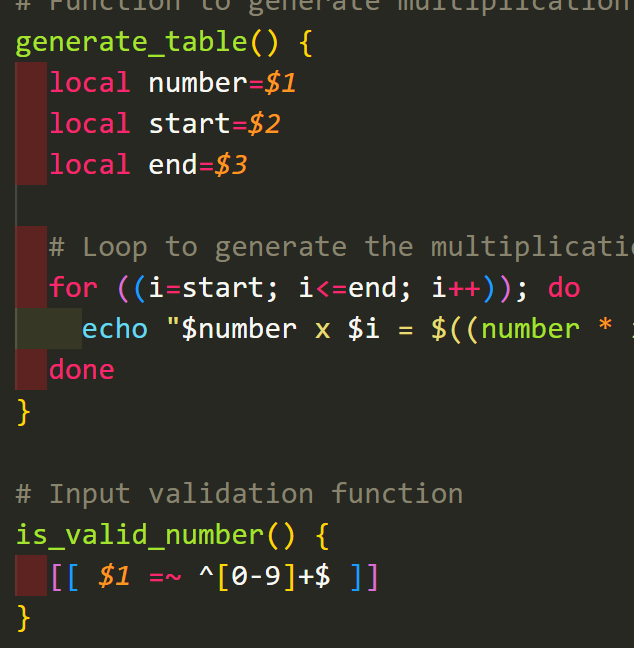
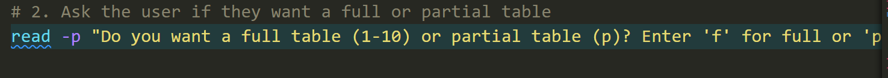
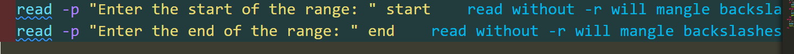
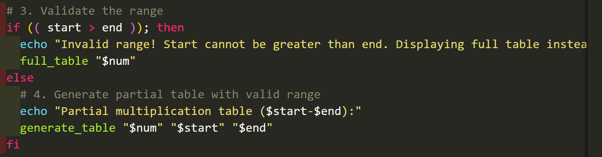
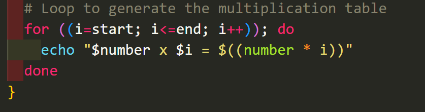
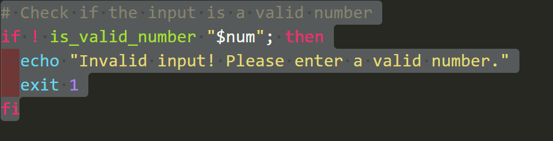
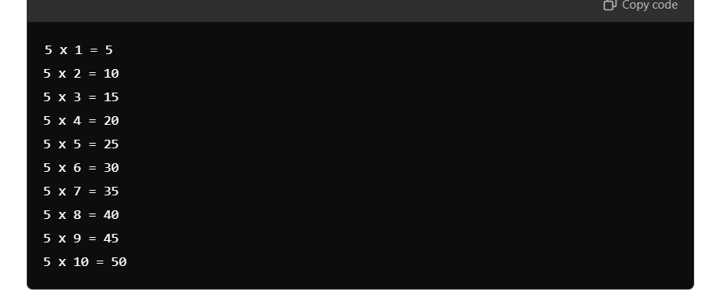
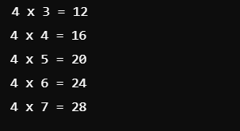

# Multiplication Table Bash Script

## Overview

This project is a simple bash script that generates a multiplication table based on user input. It allows the user to choose between generating a **full multiplication table (1-10)** or a **partial table** within a specified range. The script ensures that valid inputs are provided and handles any invalid input cases gracefully by defaulting to a full table.


## Features

- Prompt the user to input a number for which the multiplication table will be generated.
- Option to generate a full multiplication table (from 1 to 10) or a partial table based on user-defined range.
- Validation of input for the number and the range to ensure they are valid integers.
- Error handling for invalid ranges (e.g., start greater than end).
- Generates a clear and readable multiplication table using loops and conditional statements.

## Requirements

- A bash shell to execute the script.
- Ensure that the script is executable by running `chmod +x script_name.sh` in the terminal.

## Script Process Walkthrough

Below is a detailed explanation of how the script works, including screenshots of the prompts and results.

### Step 1: Inputting the Number

The script begins by asking the user to input the number for which the multiplication table will be generated.

```bash
read -p "Enter a number for which the multiplication table will be generated: " num
```

### Step 2: Choosing Full or Partial Table

The script then asks the user whether they want a full multiplication table (1-10) or a partial table within a range:

```bash
read -p "Do you want a full table (1-10) or partial table (p)? Enter 'f' for full or 'p' for partial: " choice

```



### Step 3: Specifying Range for Partial Table

If the user chooses a partial table, the script asks for the start and end of the range. It also validates if the start is less than or equal to the end.

```bash

```



### Step 4: Input Validation and Error Handling

If the user inputs an invalid range (e.g., start greater than end), the script will throw an error and default to displaying the full table.


### Step 5: Displaying the Table

The script then generates and displays the multiplication table based on the user's choice (full or partial) using a loop.


## Error Handling for Invalid Number Inputs

The script ensures that only valid numbers are input for the multiplication table, and it displays an error message if invalid input is detected:


## How to Run the Script

1. Clone the repository or download the script.
2. Make the script executable by running:
   `chmod +x nameofScript`

3. Run the script using:
`./multiplication_table.bash`

## Example Usage

- Full Table (1-10): If you select a full table for the number 5, the output will look like this:
  
- Partial Table (Range 3-7): If you select a partial table for the number 4 with a range from 3 to 7, the output will be:
  

## Contributions

Feel free to submit issues or pull requests if you would like to improve or add more functionality to this project!

## License

This project is licensed under the MIT License.
